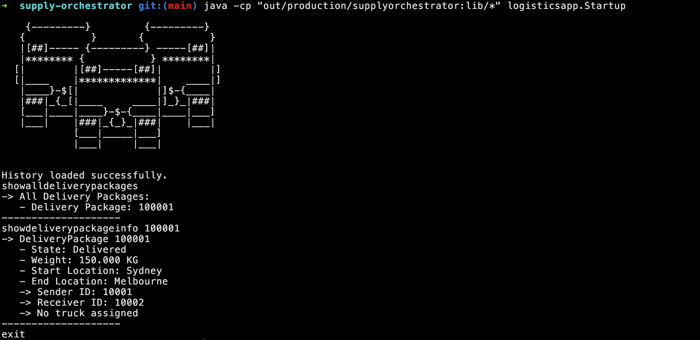
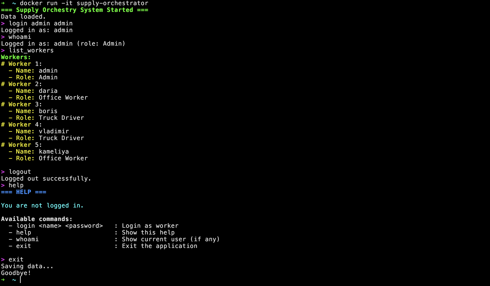

# Supply Orchestrator

This repository contains **two independent implementations** of the same logistics system:

- [Java version](https://github.com/SupplyOrchestrator/SupplyOrchestrator-Java/tree/main/supply-orchestrator)
- [C++ version](https://github.com/SupplyOrchestrator/SupplyOrchestrator-Cpp/tree/main/supply-orchestrator)

Both follow similar domain logic but differ in architecture, tooling, and design decisions.

---

# Project Versions

## [Java Version](https://github.com/SupplyOrchestrator/SupplyOrchestrator-Java/tree/main/supply-orchestrator)

### Overview
This version was developed as part of the **Telerik Academy Java program**.  
It focuses on building a clean, extensible backend system using modern Java practices.

### Architecture
- Layered architecture
- Command Pattern for handling operations
- Separation of concerns (Models / Services / Repositories / Commands)
- DTO + Mapper approach

### Tech Stack
- Java 17
- Spring Boot (if included in your final version, otherwise remove)
- Jackson (JSON processing)
- REST-style design principles

---

## [C++ Version](https://github.com/SupplyOrchestrator/SupplyOrchestrator-Cpp/tree/main/supply-orchestrator)

### Overview
This version was developed as part of coursework at the **Technical University of Sofia**.

It is a **console-based logistics management system** built with a strong focus on OOP and system design fundamentals.

### Architecture
- Command Pattern
- Layered structure (Models / Repositories / Services / Commands)
- Manual dependency management
- File-based persistence

### Tech Stack
- C++20
- STL (Standard Template Library)
- nlohmann/json
- Docker

---

# Key Differences

| Aspect                | Java Version        | C++ Version           |
|-----------------------|---------------------|-----------------------|
| Language              | Java                | C++                   |
| Runtime               | JVM                 | Native                |
| Dependency Management | Managed (libraries) | Manual                |
| Architecture          | Enterprise-style    | System-level OOP      |
| Persistence           | JSON (Jackson)      | JSON (nlohmann)       |

---

# Purpose

The goal of this repository is to:

- Compare implementations of the same system in different languages
- Demonstrate understanding of architecture and design patterns
- Showcase progression from academic to more production-oriented development

---

# Author

**Todor Krushkov**

- [GitHub](https://github.com/todorkrushkov)
- [LinkedIn](https://www.linkedin.com/in/todor-krushkov-64991433a/)
- [Instagram](https://www.instagram.com/krushkov.code/)

Software Engineering Student @ Technical University of Sofia  
Telerik Academy Graduate (Java Alpha)
---